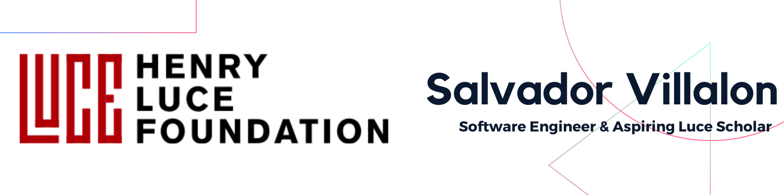

# Greetings! 

## 👨‍💻 About Me
Hello Luce Scholars Program!

My name is Salvador Villalon and this is Supplemental Materials for my application for the Luce Scholars program. I am a proud product of Calexico, CA. I am currently working at Accenture as a Software Engineer. 

## 🔭 Currently Working On
I have been working at [Accenture](https://www.accenture.com/us-en) since 2021. Through Accenture, I have worked for several clients such as
- [Code.org](https://code.org/)
- [Meta](https://about.meta.com/)
- Now I am currently doing full-stack applications at the [Internal Revenue Service](https://www.irs.gov/).

I am also a part-time Full Stack Development Instructor at [Fullstack Academy](https://www.fullstackacademy.com/) where I teach a cohort of 20 students how to become Software Engineers.

## 💪🏽 Value I Bring
### Education
Qualifications include a Bachelor’s Degree in Computer Science from the University of California, Irvine. 

### Certifications
- Currently preparing for the **AWS Cloud Practitioner Certification** using CloudGuru self-paced course
- [Agile Fundamentals - ICAgile](https://www.icagile.com/credentials/951940e1-23d1-4d6b-92ea-af916bcb2eff)
- [JavaScript Algorithms & Data Structures - freeCodeCamp](https://www.freecodecamp.org/certification/salvador_villalon_jr/javascript-algorithms-and-data-structures)
- [Responsive Web Design - freeCodeCamp](https://www.freecodecamp.org/certification/salvillalon45/responsive-web-design)

### Publications
- [How to build a web application using Flask and deploy it to the cloud](https://medium.com/free-code-camp/how-to-build-a-web-application-using-flask-and-deploy-it-to-the-cloud-3551c985e492)

### Portfolio
- [Salvador Villalon Portfolio Version 4](https://salvador-villalon.netlify.app/)
  
I bring the following to every project:
 - ✔️ Experience working on enterprise-level applications 
 - ✔️ Dedication to teamwork and flexible collaboration
 - ✔️ Resourceful team player
 - ✔️ Passion for learning and applying new things!

## 📫 Contact
- salvadorvillalon54[@].gmail.com
- [LinkedIn](https://www.linkedin.com/in/salvadorvillalon/)
- [GitHub](https://github.com/salvillalon45)
- [Medium](https://medium.com/@salvav1)
